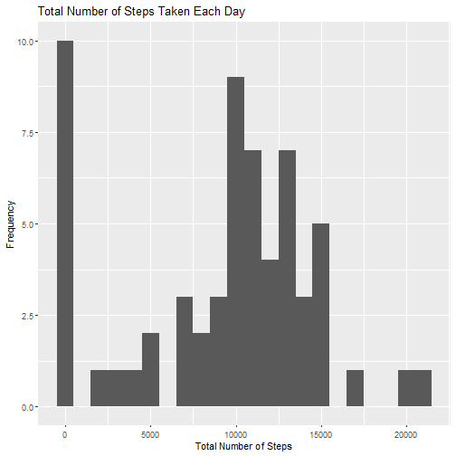
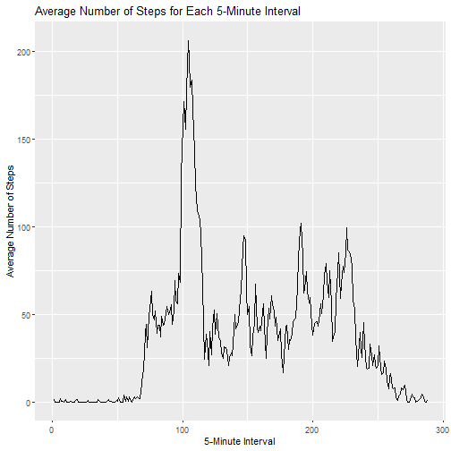
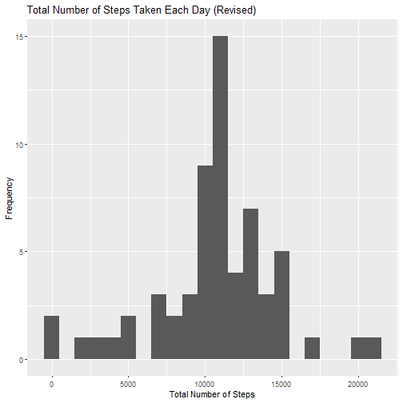
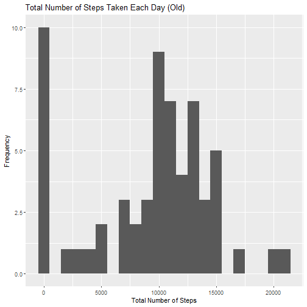
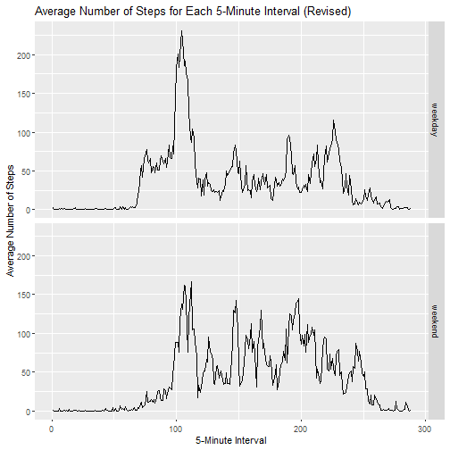

## Background

The data set used here comes from an activity monitoring device. The device collected the number of steps taken by an anonymous individual, recording in 5-minute intervals each day between October-November 2012. The data set will be processed and analyzed here.


## Loading and preprocessing the data

### Load the data

First, load the data to R, assign it to the `data` variable.


```r
if (!file.exists("activity.csv")) {
  unzip("activity.zip", "activity.csv")
}

data <- read.csv("activity.csv")
```


### Process/transform the data

Let's preview the data a bit with str().


```r
str(data)
```

```
## 'data.frame':	17568 obs. of  3 variables:
##  $ steps   : int  NA NA NA NA NA NA NA NA NA NA ...
##  $ date    : chr  "2012-10-01" "2012-10-01" "2012-10-01" "2012-10-01" ...
##  $ interval: int  0 5 10 15 20 25 30 35 40 45 ...
```

Then, let's change the classes of the columns to the appropriate ones (according to the description provided by the assignment). Furthermore, we can load several libraries while at it too, which will be used here and in future code chunks. 

Note that the data frame will be changed into a tibbe as well, which has several features that are useful in this analysis (such as prettier printing and better linking with group_by() later).


```r
# Load libraries with warn.conflicts = FALSE to suppress the long, perfunctory notifications

library(lubridate, warn.conflicts = FALSE)
library(dplyr, warn.conflicts = FALSE)


# Use mutate to change the classes of the data
# Using as_tibble() instead of tbl_df() as instructed in tibble's documentation

data <- data %>% as_tibble %>% mutate(steps = as.numeric(steps),
                                      date = ymd(date),
                                      interval = as.factor(interval))
```

Before we move on, let's do a final check of the data.


```r
str(data)
```

```
## tibble [17,568 x 3] (S3: tbl_df/tbl/data.frame)
##  $ steps   : num [1:17568] NA NA NA NA NA NA NA NA NA NA ...
##  $ date    : Date[1:17568], format: "2012-10-01" "2012-10-01" "2012-10-01" ...
##  $ interval: Factor w/ 288 levels "0","5","10","15",..: 1 2 3 4 5 6 7 8 9 10 ...
```


## What is mean total number of steps taken per day?

### Calculate total number of steps taken per day

We will calculate it using group_by() and summarize().


```r
dailystep <- data %>%
              group_by(date) %>% 
              summarize(total.step = sum(steps, na.rm = TRUE), 
                        .groups = "drop")
```


### Make a histogram of total number of steps taken each day

We will load and use ggplot2 here, which we will use for the rest of the document as well.

Note that the difference between barplot and histogram is as follows: 

- A barplot will show each bar as a representation of each category (in this case, a barplot will show each day with its own bar).

- While a histogram will show how many data have values between a certain range with each bar (in this case, how many days days have total steps between a certain range).

Source: [Robbins (2012)](https://www.forbes.com/sites/naomirobbins/2012/01/04/a-histogram-is-not-a-bar-chart/#68514fe56d77)

Therefore, the graph that will be produced below fits the description of a histogram, as it classifies and tally how many days has total steps falling between the suitable range of values.


```r
library(ggplot2, warn.conflicts = FALSE)

qplot(x = total.step, data = dailystep, 
      main = "Total Number of Steps Taken Each Day",
      xlab = "Total Number of Steps", ylab = "Frequency", 
      binwidth = 1000)
```




### Calculate and report the mean and median of the total number of steps taken per day

Let's calculate the mean and median first.


```r
# Note that na.rm is not needed, as it is already used in calculating dailystep$total.step

stepmean <- mean(dailystep$total.step)
stepmedian <- median(dailystep$total.step)
```

In the next sentence, the mean and median will be reported:

The **mean** total number of steps taken per day is **9354.22950819672**, while the **median** total number of steps taken per day is **10395**.


## What is the average daily activity pattern?

### Make a time series plot

The time series will be constructed with the 5-minute interval as x-axis, 
while the average number of steps taken, for each of the 5-minute interval (see the original phrasing in the assignment instruction for the reason) averaged across all days, will be its y-axis.

First, let's calculate the average number of steps, averaged across all days, for each of the 5-minute interval.


```r
intervalaverage <- data %>% 
                    group_by(interval) %>% 
                    summarize(average.steps = mean(steps, na.rm = TRUE), 
                              .groups = "drop")
```

Then, let's make the time series plot. As we will be using ggplot2, type = "l" will not be used (it is intended for base plotting system).


```r
qplot(x = as.integer(interval), y = average.steps, 
      data = intervalaverage, geom = "line",
      main = "Average Number of Steps for Each 5-Minute Interval",
      xlab = "5-Minute Interval", ylab = "Average Number of Steps")
```



### Which 5-minute interval contains the maximum average number of steps?

Let's calculate first the maximum average value in a code chunk (to make the calculation easier to examine).


```r
maxaverageinterval <- intervalaverage %>% 
                        filter(average.steps == max(average.steps)) %>% 
                        select(interval)

maxaverageinterval
```

```
## # A tibble: 1 x 1
##   interval
##   <fct>   
## 1 835
```

However, we can extract and prettify the result a bit, so let's do that with a short chunk of code.


```r
# Some finishing touches

maxaverageinterval <- as.character(maxaverageinterval$interval)
maxaverageinterval <- paste0(rep("0", 4 - nchar(maxaverageinterval)),
                             maxaverageinterval)
maxaverageinterval <- paste0(substr(maxaverageinterval, 1, 2), 
                             ":",
                             substr(maxaverageinterval, 3, 4))
```

As a result, across all the days in the data set, the 5-minute interval with the **maximum** average number of steps is the **08:35** interval.


## Imputing missing values

### Calculate and report the total number of missing values in the data set

Let's calculate first how many rows have NAs.


```r
# I have checked that only the steps variable have NA values, 
# But we will use complete.cases() for the sake of completeness

totalNA <- sum(!with(data, complete.cases(steps, date, interval)))
```

Now, let's prove in the next code chunk that all the NA values come from the `steps`
variable.


```r
# Verify to ensure that the number of missing values is all attributed to the steps variable

totalNA == sum(is.na(data$steps))
```

```
## [1] TRUE
```

```r
# As we can see, all the missing values come from the steps variable
```

Finally, in the next sentence, the total number of missing values in the data set will be reported:

Therefore, after calculation, the **total** number of missing values **2304**, consisting entirely of missing values in the `steps` variable.


### Devise a strategy for filling in all of the missing values in the dataset

Because we have seen that the number of steps vary across the day, between each 5-minute interval, I think using the mean of that particular 5-minute interval is a good way to fill the missing values. Some of possible perceived benefits:

- The accuracy of each 5-minute interval average will not be affected by the imputation (because we are using that to fill the missing values).

- If the number of steps in a particular day is remarkably high or low, the feature will be preserved or even enhanced in distinctness as we normalize them compared to its peers.

Note that the first benefit is even more salient considering that the first day in the data set is actually filled entirely with NAs:


```r
# Formatted into percentage (using * 100 to convert from decimal to percentage)
paste0(mean(is.na(data %>% filter(date == min(date)) %>% select(steps))) * 100, "%") 
```

```
## [1] "100%"
```


### Create a new data set with the missing data filled in

The new data set will be equal to the original data set, except the missing data is filled in.


```r
# From all joins available in dplyr, explicitly using left_join()
# The average steps is joined first (to make it easier to fill the missing values), 
# then removed after the missing values have been filled

newdata <- data %>% 
              left_join(intervalaverage, by = "interval") %>%
              mutate(steps = if_else(is.na(steps), average.steps, steps),
                     average.steps = NULL)

newdata
```

```
## # A tibble: 17,568 x 3
##     steps date       interval
##     <dbl> <date>     <fct>   
##  1 1.72   2012-10-01 0       
##  2 0.340  2012-10-01 5       
##  3 0.132  2012-10-01 10      
##  4 0.151  2012-10-01 15      
##  5 0.0755 2012-10-01 20      
##  6 2.09   2012-10-01 25      
##  7 0.528  2012-10-01 30      
##  8 0.868  2012-10-01 35      
##  9 0      2012-10-01 40      
## 10 1.47   2012-10-01 45      
## # ... with 17,558 more rows
```

### Effects of imputing missing data

#### Calculation of several comparisons

First, let's calculate the new total number of steps taken per/each day.
big data best practice sharing 19 oktober

```r
newdailystep <- newdata %>%
                  group_by(date) %>% 
                  summarize(total.step = sum(steps), 
                            .groups = "drop")
```

Next, let's make a histogram of the total number of steps taken each day, the same way we make the histogram before, on the very same topic (see the arguments in the second section).


```r
qplot(x = total.step, data = newdailystep, 
      main = "Total Number of Steps Taken Each Day (Revised)",
      xlab = "Total Number of Steps", ylab = "Frequency", 
      binwidth = 1000)
```



**To ease comparison later on, here we will display the previous plot below.**


```r
qplot(x = total.step, data = dailystep, 
      main = "Total Number of Steps Taken Each Day (Old)",
      xlab = "Total Number of Steps", ylab = "Frequency", 
      binwidth = 1000)
```



Now, the mean and median total number of steps taken per day will be calculated and reported.

Let's calculate the number first.


```r
newstepmean <- mean(newdailystep$total.step)
newstepmedian <- median(newdailystep$total.step)
```

Then, in the next sentence, the mean and median will be reported:

The **mean** total number of steps taken per day is **10766.1886792453**, while the **median** total number of steps taken per day is **10766.1886792453**.

Let's now see the difference between the new values with the old values, which will be compared using facets and the right tibble arrangement...


```r
comparisondata <- tibble(oldnew = as.factor(c(rep("Old", 2), rep("New", 2))),
                         type = as.factor(c("Mean", "Median", "Mean", "Median")),
                         value = c(stepmean, stepmedian, newstepmean, newstepmedian))

qplot(x = oldnew, y = value, data = comparisondata,
      main = "Comparing the New and Old Data Set (Mean and Median)",
      xlab = "Type of Value", ylab = "Value",
      geom = "col", facets = .~ type)
```


As we can see, the histograms were different, and the values here are different.


#### Histogram

Notice that there are significantly less days with total number of steps between 0-1,000 with the new data set, and those days seem to move to the range between 10,000-11,000.

Why is it this way? The reason is, after further investigation, it seems that the NAs are all concentrated in a few days, and during those few days there were previously zero steps recorded with sum() using na.rm = TRUE. Let's construct a simple comparison to explain and prove it:


```r
filter(dailystep, total.step != newdailystep$total.step)
```

```
## # A tibble: 8 x 2
##   date       total.step
##   <date>          <dbl>
## 1 2012-10-01          0
## 2 2012-10-08          0
## 3 2012-11-01          0
## 4 2012-11-04          0
## 5 2012-11-09          0
## 6 2012-11-10          0
## 7 2012-11-14          0
## 8 2012-11-30          0
```

It means that all the missing values are replacing NAs in these eight days, filling the values of the entirety of the day. No wonder there is a massive migration from the range of 0-1000. But why these days are moved towards the range of 10,000-11,000? Because the average number of steps across all 5-minute intervals, if summed up, is as follows:


```r
sum(intervalaverage$average.steps)
```

```
## [1] 10766.19
```
As it falls between 10,000 and 11,000, thus those days whose NAs we have been filling are moved into the 10,000-11,000 range.


#### Mean and median

We see that the mean and median of the new data set is higher than the mean and median of the old data set, which are perfectly intuitive as the NAs we are filling will definitely contribute into higher sum and drag the median higher with the transformation of those zero-step days (or at least zero step with sum() and na.rm = TRUE).

Having said that, perhaps the more curious result is why the new mean and median has exactly the same height and indeed, the same value: 10,766.19. In fact, the same number with the sum of all 5-minute interval averages!

As for the mean, a few R expressions will likely illustrate the reason better than sentences:


```r
# Calculate how many days are within the data set
numberofdays <- length(unique(data$date))

numberofdays
```

```
## [1] 61
```

```r
# Multiply the number of days with the old mean step per day we already have,
# which is actually equal to our total steps (mean * number of data, right?)

totalsteps <- numberofdays * stepmean

totalsteps
```

```
## [1] 570608
```

```r
# Now, we know that out of all those days, there are a few whose values are completely
# filled with NAs. There are 8 days with that characteristic in total, as shown in the
# dimension of the previous tibble, but we can calculate it again if we want: 

NAdays <- nrow(filter(dailystep, total.step != newdailystep$total.step))

NAdays
```

```
## [1] 8
```

```r
# If that is so, how much valid days do we actually have in the data set?
# Let's calculate it:

validdays <- numberofdays - NAdays

validdays
```

```
## [1] 53
```

```r
# Now, let's see what happens if we divide our previous total steps
# with the number of valid days...

totalsteps / validdays
```

```
## [1] 10766.19
```

It is exactly the same with our previous number. If we discard the NA days and calculate our old mean using the data of just the valid days (but remember this is not our instruction to carry out), we would have found that the "real" mean is 10,766.19. 

Because we, essentially, fill the NA days with the old total daily steps mean, it makes sense that the number eventually add up to its real number: 10,766.18, and this is the reason behind our mean having the number of 10,766.19

As for the median, there is no particular reason why it has to be exactly 10,766.19, but the addition of many days with 10,766.19 might have made it far more likely that the median number becomes 10,766.19 as well, especially considering the distribution of the values as seen in the histogram (a bell-shaped curve).


#### Conclusion

These are the reasons behind the numbers. Thus, the method we use to fill the missing values becomes ironically suitable with the characteristic of the data...


## Are there differences in activity patterns between weekdays and weekends?

### Create a factor variable with two levels - "weekday" and "weekend"

Let's create this factor variable using wday() from lubridate (might as well use it since we have loaded the library as well!).


```r
newdata <- newdata %>% 
            mutate(day = wday(date, label = TRUE)) %>%
            mutate(day = as.factor(if_else(day %in% c("Sat", "Sun"),
                                 "weekend", "weekday")))
```


### Make a time series panel plot

The time series panel will be constructed with the 5-minute interval as x-axis, 
while the average number of steps taken, for each of the 5-minute interval (see the original phrasing in the assignment instruction for the reason) averaged across all weekday days or weekend days, will be its y-axis.

First, let's calculate the new average number of steps, which will be averaged across all weekday days or weekend days, for each of the 5-minute interval.


```r
newintervalaverage <- newdata %>% 
                    group_by(interval, day) %>% 
                    summarize(average.steps = mean(steps, na.rm = TRUE), 
                              .groups = "drop")
```

Then, let's make the time series panel plot. As we will be using ggplot2, type = "l" will not be used as in the previous time series (type = "l" is intended for base plotting system).


```r
qplot(x = as.integer(interval), y = average.steps, 
      data = newintervalaverage, geom = "line",
      main = "Average Number of Steps for Each 5-Minute Interval (Revised)",
      xlab = "5-Minute Interval", ylab = "Average Number of Steps",
      facets = day ~.)
```


